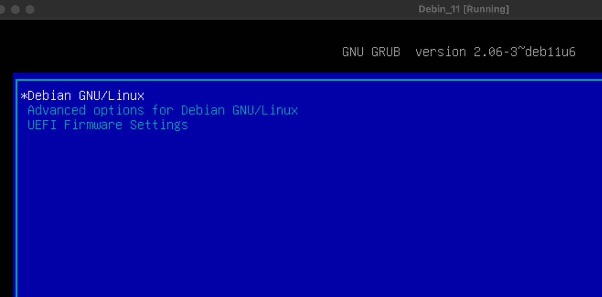
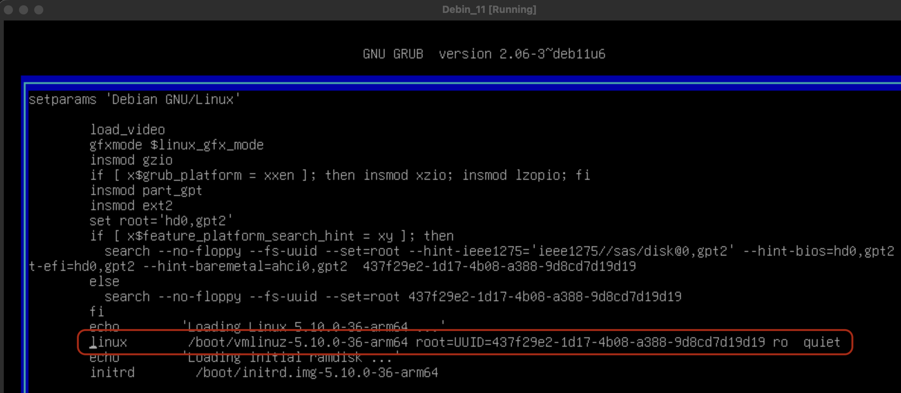
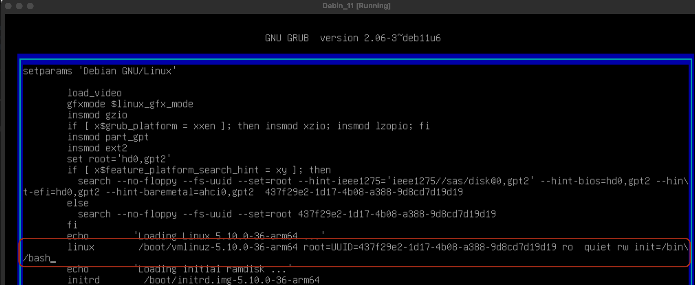

# 1) Configuración del entorno

## 1. La máquina virtual está dividida en partes y comprimidas en formato **.rar**. Es necesario descargar y ensamblar los archivos utilizando herramientas como **WinRar**.

La máquina virtual original distribuida para este TP no resultó compatible con equipos Apple Silicon (arquitectura ARM), impidiendo su ejecución tanto en UTM como en VirtualBox.
Debido a esta limitación, se decidió descartar esa imagen prearmada y comenzar desde cero utilizando una ISO oficial de Debian ARM 64 bits (debian-11.11.0-arm64-netinst.iso).
A partir de esa base se continuó con la instalación, configuración inicial y personalización del entorno de servidor.

La imagen orignal se descarga de la [web oficial de debian](https://meetings-archive.debian.net/cdimage/archive/11.11.0/arm64/iso-cd/)

## Entorno de Trabajo y Herramientas

Para la realización de las descargas y gestión de imágenes de disco, utilizaremos la terminal de **macOS**.

Gracias a la herencia directa de **BSD Unix**, macOS proporciona un entorno nativo compatible con **POSIX**, lo que nos permite utilizar herramientas estándar de línea de comandos (como `curl`, `sh` o `tar`) y gestionar sistemas de archivos de manera idéntica a como se haría en otros entornos Unix o Linux, sin necesidad de software de terceros o virtualización para estas tareas básicas.

## Alternativa 1 - Curl
Si bien existe wget para macOS no viene instalado por defecto.

A diferencia de muchas distribuciones de Linux, macOS incluye por defecto una herramienta muy similar llamada curl, que es ideal para descargar archivos.

```bash
curl -O -L https://meetings-archive.debian.net/cdimage/archive/11.11.0/arm64/iso-cd/debian-11.11.0-arm64-netinst.iso

goku@MBP-de-Goku ~ # curl -O -L https://meetings-archive.debian.net/cdimage/archive/11.11.0/arm64/iso-cd/debian-11.11.0-arm64-netinst.iso
  % Total    % Received % Xferd  Average Speed   Time    Time     Time  Current
                                 Dload  Upload   Total   Spent    Left  Speed
100   418  100   418    0     0    453      0 --:--:-- --:--:-- --:--:--   453
100  329M  100  329M    0     0  9563k      0  0:00:35  0:00:35 --:--:-- 11.3M
goku@MBP-de-Goku ~ % 
```

## Alternativa 2 - wget

Otra opción de descarga es usar el wget de linux, pero en macOS no viene por defecto, así que hay que tener el administrador de paquetes Homebrew e instalarlo.

### Paso 1: Instalación de Homebrew

En caso de no tener el administrador de paquete Homebrew, se puede instalar de la siguente forma en macOS Apple Silicon. En macOS Intel varian las ultimas instrucción del zprofile.

```bash
/bin/bash -c "$(curl -fsSL https://raw.githubusercontent.com/Homebrew/install/HEAD/install.sh)"

echo 'eval "$(/opt/homebrew/bin/brew shellenv)"' >> ~/.zprofile
eval "$(/opt/homebrew/bin/brew shellenv)"

brew --version
```

### Paso 2: Instalación de wget con Homebrew
```bash
brew install wget

goku@MBP-de-Goku ~ # brew install wget
==> Installing dependencies for wget: libunistring, gettext, libidn2, ca-certificates and openssl@3
==> Installing wget dependency: libunistring
==> Pouring libunistring--1.4.1.arm64_tahoe.bottle.tar.gz
🍺  /opt/homebrew/Cellar/libunistring/1.4.1: 59 files, 5.8MB
==> Installing wget dependency: gettext
==> Pouring gettext--0.26_1.arm64_tahoe.bottle.tar.gz
🍺  /opt/homebrew/Cellar/gettext/0.26_1: 2,428 files, 29.5MB
==> Installing wget dependency: libidn2
==> Pouring libidn2--2.3.8.arm64_tahoe.bottle.tar.gz
🍺  /opt/homebrew/Cellar/libidn2/2.3.8: 80 files, 946.1KB
==> Installing wget dependency: ca-certificates
==> Pouring ca-certificates--2025-12-02.all.bottle.tar.gz
==> Regenerating CA certificate bundle from keychain, this may take a while...
🍺  /opt/homebrew/Cellar/ca-certificates/2025-12-02: 4 files, 236.4KB
==> Installing wget dependency: openssl@3
==> Pouring openssl@3--3.6.0.arm64_tahoe.bottle.tar.gz
🍺  /opt/homebrew/Cellar/openssl@3/3.6.0: 7,609 files, 37.7MB
==> Installing wget
==> Pouring wget--1.25.0.arm64_tahoe.bottle.tar.gz
🍺  /opt/homebrew/Cellar/wget/1.25.0: 92 files, 4.7MB
==> Running `brew cleanup wget`...
Disable this behaviour by setting `HOMEBREW_NO_INSTALL_CLEANUP=1`.
Hide these hints with `HOMEBREW_NO_ENV_HINTS=1` (see `man brew`).
goku@MBP-de-Goku ~ % 
```

### Paso 3: Descarga del Archivo con wget

```bash
wget https://meetings-archive.debian.net/cdimage/archive/11.11.0/arm64/iso-cd/debian-11.11.0-arm64-netinst.iso


goku@MBP-de-Goku ~ # wget https://meetings-archive.debian.net/cdimage/archive/11.11.0/arm64/iso-cd/debian-11.11.0-arm64-netinst.iso
--2025-12-07 11:33:51--  https://meetings-archive.debian.net/cdimage/archive/11.11.0/arm64/iso-cd/debian-11.11.0-arm64-netinst.iso
Resolviendo meetings-archive.debian.net (meetings-archive.debian.net)... 194.71.11.173, 194.71.11.165
Conectando con meetings-archive.debian.net (meetings-archive.debian.net)[194.71.11.173]:443... conectado.
Petición HTTP enviada, esperando respuesta... 302 Found
Localización: https://gemmei.ftp.acc.umu.se/cdimage/archive/11.11.0/arm64/iso-cd/debian-11.11.0-arm64-netinst.iso [siguiendo]
--2025-12-07 11:33:52--  https://gemmei.ftp.acc.umu.se/cdimage/archive/11.11.0/arm64/iso-cd/debian-11.11.0-arm64-netinst.iso
Resolviendo gemmei.ftp.acc.umu.se (gemmei.ftp.acc.umu.se)... 194.71.11.137
Conectando con gemmei.ftp.acc.umu.se (gemmei.ftp.acc.umu.se)[194.71.11.137]:443... conectado.
Petición HTTP enviada, esperando respuesta... 200 OK
Longitud: 345288704 (329M) [application/x-iso9660-image]
Grabando a: «debian-11.11.0-arm64-netinst.iso»

debian-11.11.0-arm64-netinst.iso      100%[========================================================================>] 329,29M  8,76MB/s    en 36s     

2025-12-07 11:34:29 (9,22 MB/s) - «debian-11.11.0-arm64-netinst.iso» guardado [345288704/345288704]

goku@MBP-de-Goku ~ % 
```

Una vez que tenemos la imagen, para lograr la instalación se siguen los mismos pasos del modulo 1 donde se indica como instalar debian desde una imagen.

[Documentacion Instalacion](./docs/0306_APU_DescargaDeLinux_V2.pdf)


---

## 2. La clave de root es desconocida inicialmente, por lo que debe ser **blanqueada** antes de comenzar. Una vez dentro del sistema operativo, se debe cambiar por **"palermo"** (sin comillas).

En este caso particular, al tratarse de una instalación nueva, se conoce la contraseña de root, pero para fines prácticos simularemos que no la sabemos y la reemplazaremos igualmente por *palermo*.

### Cambiar password root desde GRUB

1. Reiniciar la máquina.
2. En el menú de GRUB, seleccionar la entrada de Debian.



3. Antes de iniciar, presionar **`e`** para editar.
4. Buscar la línea que comienza con:

```
linux /boot/vmlinuz-....
```


5. Al final de esa línea agregar:

```
rw init=/bin/bash
```
Debe quedar similar a:

```
linux /boot/vmlinuz-... ro quiet rw init=/bin/bash
```


6. Presionar **Ctrl+X** o **F10** para iniciar.  
   El sistema arrancará en **shell como root**.

7. Cambiar la contraseña ingresando "palemos" com clave:

```
passwd root
```

8. Reiniciar la máquina virtual:

```
reboot -f
```

---

## 3. Establecer hostname como **TPServer**

1. Abrir la terminal o estar dentro de una

2. Obtener permisos de administrador (si no iniciamos sesion como root):

```bash
su -
```

3. Establecer el nuevo hostname:

```bash
hostnamectl set-hostname TPServer
```

* hostnamectl modifica el nombre del host guardándolo en la configuración del sistema.
* Este comando por sí solo cambia el hostname permanente, pero todavía falta que el sistema lo reconozca en la resolución local.


4. Editar el archivo /etc/hosts para reflejar el cambio:

```bash
nano /etc/hosts
```

Agregar o modificar la línea para que quede similar a:
```bash
127.0.1.1   TPServer
```
* Aquí se agrega el hostname para evitar que el sistema tenga problemas al resolver su propio nombre.


5. Guardar y salir de nano (Ctrl+O, Enter y luego Ctrl+X).

6. Reiniciar el sistema para aplicar definitivamente el cambio:

```bash
reboot
```

También se puede reiniciar el servicio
```bash
systemctl restart systemd-logind.service
```

### Comandos de verificación

1. Ver hostname actual del sistema:
```bash
root@TPServer:~# hostnamectl
   Static hostname: TPServer
         Icon name: computer
        Machine ID: 96a06e0cf65447d98dc4ce066c47bd61
           Boot ID: b1e9515f56764805959022769531572c
  Operating System: Debian GNU/Linux 11 (bullseye)
            Kernel: Linux 5.10.0-36-arm64
      Architecture: arm64
```

Ver solo el hostname:
```bash
root@TPServer:~# hostname
TPServer
```

2. Confirmar que resuelva correctamente en local:
```bash
root@TPServer:~# ping -c 3 TPServer
PING TPServer (127.0.1.1) 56(84) bytes of data.
64 bytes from TPServer (127.0.1.1): icmp_seq=1 ttl=64 time=0.032 ms
64 bytes from TPServer (127.0.1.1): icmp_seq=2 ttl=64 time=0.094 ms
64 bytes from TPServer (127.0.1.1): icmp_seq=3 ttl=64 time=0.088 ms

--- TPServer ping statistics ---
3 packets transmitted, 3 received, 0% packet loss, time 2010ms
rtt min/avg/max/mdev = 0.032/0.071/0.094/0.027 ms
```
Debe responder desde 127.0.1.1, que es lo que se definió en el paso anterior del /etc/hosts para la resolución de nombres DNS.

