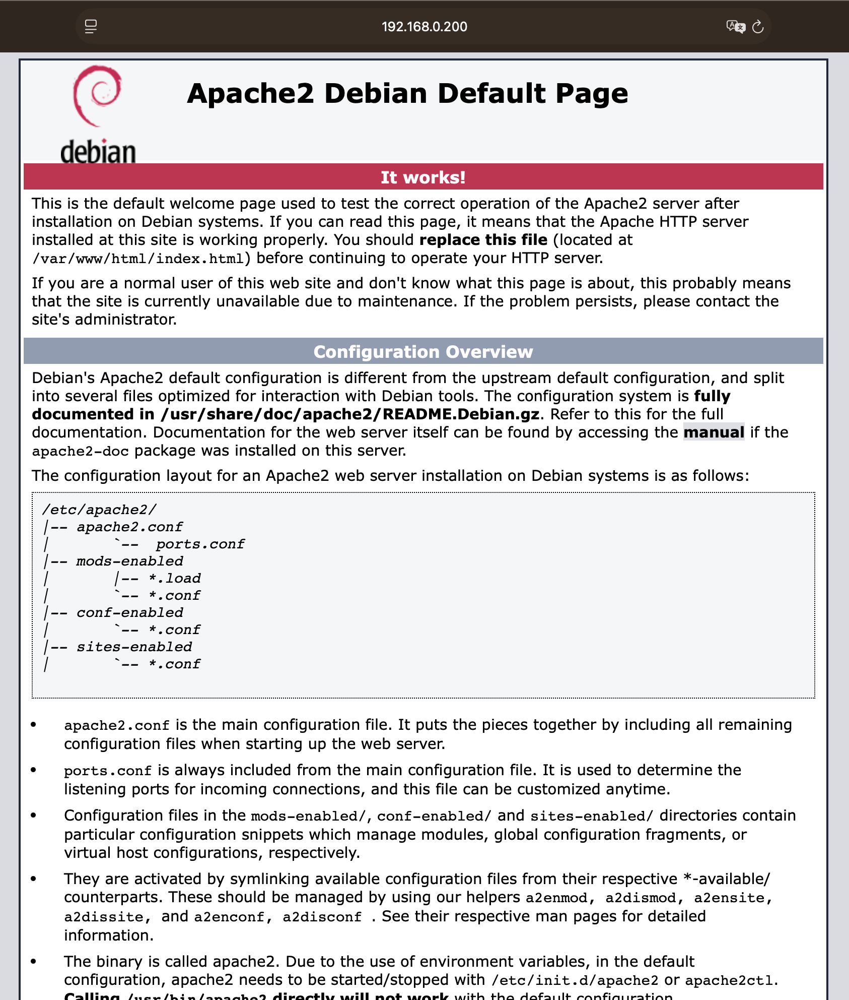
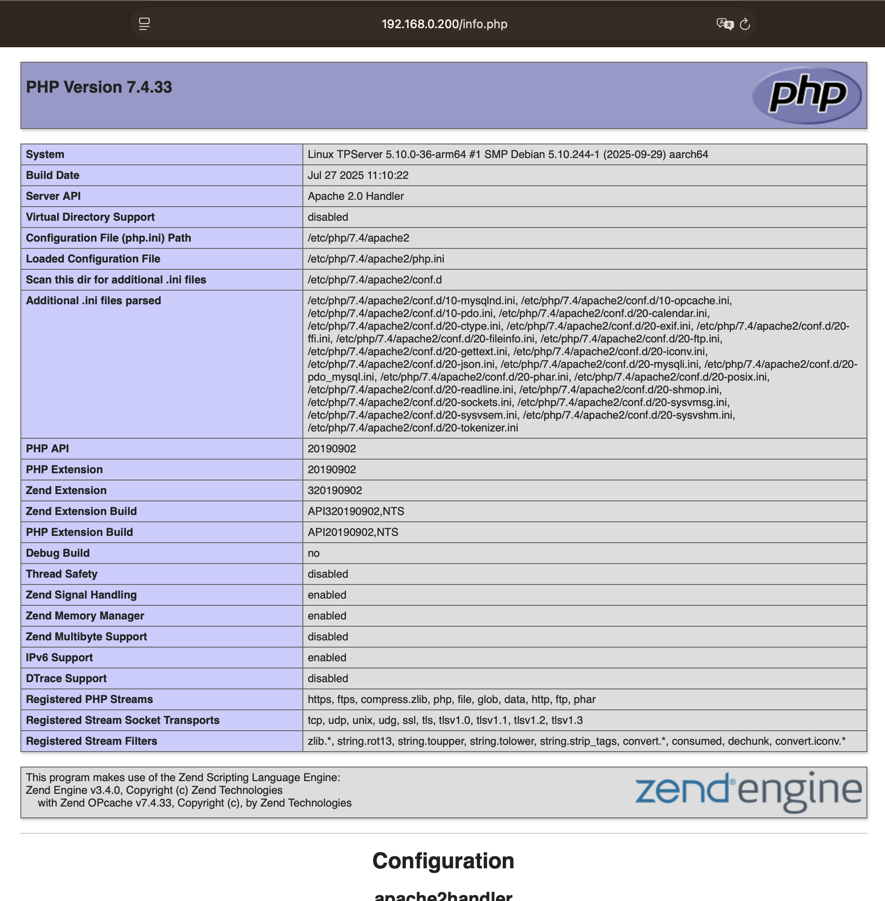
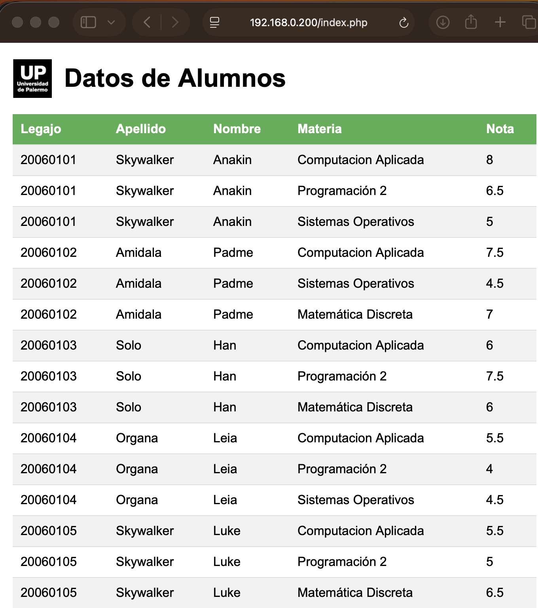

# 2) Configuración e instalación de servicios que ofrecerá el server TPServer


## 1. SSH: instalar y configurar el servicio de SSH. El servidor debe permitir el acceso al usuario root mediante una clave privada/pública, proporcionada junto con la máquina virtual en Blackboard.

Para realizar estos pasos nos basamos en el modulo 4 donde se indica como instalar el servicio SSH, como configurarlo y como copiar la clave publica/privada.

[Documentacion SSH](./docs/0306_APU_SSH_251Q_V2.pdf)

## 1.1 Instalar el server SSH

1. Abrir la terminal del server TPServer

2. Obtener permisos de administrador (si no iniciamos sesion como root):

```bash
su -
```

3. Usamos el administador de paquetes apt-get para realizar la instalación

```bash
apt-get install openssh-server
```

4. Editar el archivo de configuración para permitir que root pueda conectarse desde la terminal remota con el ssh

Los archivos de configuración de OpenSSH se encuentran en /etc/ssh. En nuestro caso configuraremos el server que esta en el archivo sshd_config

Editamos el archivo sshd_config y modificamos la linea PermitRootLogin poniendola como "yes" para permitir el acceso remotor de root.

```bash
vi sshd_config
```

Controlamos que el cambio en el archivo se haya realizado.

```bash
root@TPServer:/etc/ssh# cat sshd_config | grep -i permitroot
PermitRootLogin yes
# the setting of "PermitRootLogin without-password".
```

Luego reiniciamos el server ssh
```bash
systemctl restart sshd
```

Con esto ya estamos listos para contectanos remotamente el server TPServer, pero aun nos solicitará la password para conectarnos porque no le hemos enviado la clave publica/privada.

## 1.2 Transferir la clave publica/privada

En nuestro caso, el cliente de conexión será el ssh desde la terminal de **macOS**. Donde utilizaremos el cliente ssh y el ssh-copy-id para transferir la clave publica/privada.

Seguiremos los pasos de la [Documentacion SSH](./docs/0306_APU_SSH_251Q_V2.pdf) para hacer la copia de las llaves, pero con la diferencia que las mismas han sido siministradas para este TP en los archivos [clave_privada.txt](./docs/clave_privada.txt) y [clave_publica.pub](./docs/clave_publica.pub)

## 1.2.1 Transferir la clave publica/privada

Si aplicamos el comando ssh-id-copy como esta en la documentación del modulo 4 obtendremos un error:

```bash
ssh-copy-id root@192.168.0.200
```

```diff
+ ERROR: No identities found.
```

Y esto se debe a que a que ssh-copy-id solo copia claves que estén con el nombre típico id_rsa y id_rsa.pub y en la carpeta ~/.ssh:

Pero en este caso, tenemos otros nombres distintos suministrados:

```bash
clave_privada.txt
clave_publica.pub
```

Si ejecutamos el comando veremos como se comporta

```bash
goku@MBP-de-Goku Material adicional # l 
total 32 
drwxr-xr-x 6 goku staff 192 22 nov. 17:51 .
drwxr-xr-x 8 goku staff 256 6 dic. 16:36 ..
-rw-r--r--@ 1 goku staff 2622 22 nov. 17:51 clave_privada.txt
-rw-r--r--@ 1 goku staff 582 22 nov. 17:51 clave_publica.pub 
-rw-r--r--@ 1 goku staff 1786 22 nov. 17:51 db.sql
-rw-r--r--@ 1 goku staff 2325 22 nov. 17:51 index.php
goku@MBP-de-Goku Material adicional # ssh-copy-id root@192.168.0.200
/usr/bin/ssh-copy-id: INFO: Source of key(s) to be installed:
/usr/bin/ssh-copy-id: ERROR: No identities found
```

Para solucionar esto tenemos que hacer estos pasos:

## 1.2.2. Crear carpeta .ssh si no existe
```bash
mkdir -p ~/.ssh
chmod 700 ~/.ssh
```

## 1.2.3. Copiar tus claves a la carpeta correcta
```bash
cp "Material adicional/clave_privada.txt" ~/.ssh/id_rsa
cp "Material adicional/clave_publica.pub" ~/.ssh/id_rsa.pub
```

## 1.2.4. Ajustar permisos (si no SSH las rechaza el uso de las claves)
```bash
chmod 600 ~/.ssh/id_rsa
chmod 644 ~/.ssh/id_rsa.pub
```

## 1.2.5. Transferir la clave publica/privada
```bash
ssh-copy-id -i ~/.ssh/id_rsa.pub root@192.168.0.200
```

## 2. WEB: instalar y configurar el servidor Apache con soporte para PHP (versión 7.3 o superior). Configurar el servidor para servir el archivo “index.php” y “logo.png”, disponible junto con la máquina virtual en Blackboard.

Como primera medida vamos a verificar si contamos con apache y PHP instalado, y no deberían estaralos ya que la versión de TPServer no los trae por defecto, luego de eso procederemos a instalarlos con el administrador de paquetes apt-get

## 2.1. Instalación Apache Server

1. Abrir la terminal del server TPServer
2. Obtener permisos de administrador (si no iniciamos sesion como root):
```bash
root@TPServer:~# su -
```
3. Verificar si Apache está instalado
```bash
root@TPServer:~# apache2 -v
-bash: apache2: command not found
```
Aqui correctamente obtenemos **apache2: command not found** ya que no esta instalado apache.

4. Instalar Apache

Como en este punto ya estamos con el usuario root, no hace fala correr los comandos con el comando sudo.

Primero actualizamos la lista local de paquetes disponibles desde los repositorios de debian y luego instalamos Apache

```bash
root@TPServer:~# apt-get update
root@TPServer:~# apt-get install apache2 -y
```

Luego se habilita e inicia el servicio del servidor web Apache HTTP. 

El comando systemctl con el parametro **enable** asegura que el servicio apache se inicie automáticamente cada vez que el sistema operativo Linux arranca.

El comando systemctl con el parametro **start** inicia el servicio inmediatamente en la sesión actual.

```bash
root@TPServer:~# systemctl enable apache2
root@TPServer:~# systemctl start apache2
```

El resultado esperado es similar a este:
```bash
root@TPServer:~# systemctl enable apache2 
Synchronizing state of apache2.service with SysV service script with /lib/systemd/systemd-sysv-install.
Executing: /lib/systemd/systemd-sysv-install enable apache2
root@TPServer:~# systemctl start apache2
root@TPServer:~# 
```

Verificamos que el servidor Apache este correctamente instalado:
```bash
root@TPServer:~# systemctl status apache2
```

El resultado esperado es similar a este:
```bash
root@TPServer:~# systemctl status apache2
● apache2.service - The Apache HTTP Server
     Loaded: loaded (/lib/systemd/system/apache2.service; enabled; vendor preset: enabled)
     Active: active (running) since Sun 2025-12-07 21:30:42 -03; 9min ago
       Docs: https://httpd.apache.org/docs/2.4/
   Main PID: 1340 (apache2)
      Tasks: 55 (limit: 2242)
     Memory: 8.8M
        CPU: 61ms
     CGroup: /system.slice/apache2.service
             ├─1340 /usr/sbin/apache2 -k start
             ├─1342 /usr/sbin/apache2 -k start
             └─1343 /usr/sbin/apache2 -k start

Dec 07 21:30:42 TPServer systemd[1]: Starting The Apache HTTP Server...
Dec 07 21:30:42 TPServer apachectl[1339]: AH00558: apache2: Could not reliably determine the servers fully qualified domain name, using 127.0.1.1. Se>
Dec 07 21:30:42 TPServer systemd[1]: Started The Apache HTTP Server.
root@TPServer:~# 
```

Luego desde el navegador de la Mac apuntamos a la IP del server TPDebian y verificamos que responda, en nuestro caso http://192.168.0.200/



## 2.2. Instalación PHP

1. Abrir la terminal del server TPServer
2. Obtener permisos de administrador (si no iniciamos sesion como root):
```bash
root@TPServer:~# su -
```

3. Verificar si Apache está instalado
```bash
root@TPServer:~# php -v
-bash: php: command not found
root@TPServer:~# 
```
Aqui correctamente obtenemos **php: command not found** ya que no esta instalado PHP.

4. Instalar PHP y los paquetes necesarios

Paquetes a instalar de PHP:

| Paquete | Función |
|--------|---------|
| **php** | Instala el núcleo del lenguaje PHP. En Debian 11 normalmente viene PHP 7.4 por defecto. |
| **libapache2-mod-php** | Módulo que permite a Apache interpretar y ejecutar archivos `.php`. Sin este módulo Apache solo serviría HTML estático. |
| **php-cli** | Permite ejecutar scripts PHP desde consola (`php script.php`). Útil para debugging y tareas administrativas. |
| **php-common** | Archivos base y dependencias compartidas por extensiones PHP. Necesario para un entorno PHP funcional. |
| **php-mysqlnd** | Conector nativo para MariaDB/MySQL. Permite que PHP se conecte a bases de datos sin instalar el servidor MariaDB.|

---

### Comando de instalación:
```bash
root@TPServer:~# apt-get install php libapache2-mod-php php-cli php-common php-mysqlnd -y
```

Verificar versión de PHP instalada
```bash
root@TPServer:~# php -v
PHP 7.4.33 (cli) (built: Jul 27 2025 11:10:22) ( NTS )
Copyright (c) The PHP Group
Zend Engine v3.4.0, Copyright (c) Zend Technologies
    with Zend OPcache v7.4.33, Copyright (c), by Zend Technologies
root@TPServer:~# 
```

Verificar si el conector de MariaDB/MySQL está disponible en PHP
```bash
root@TPServer:~# php -m | grep mysql
mysqli
mysqlnd
pdo_mysql
root@TPServer:~# 
```

5. Probar PHP en Apache

Para probar que el punto anterior dejó todo correcto vamos a crear un simple programa de PHP que nos retornará la información la información de la función phpinfo() de PHP.

Crear un archivo en /var/www/html

```bash
root@TPServer:~# echo "<?php phpinfo(); ?>" > /var/www/html/info.php
root@TPServer:~# l /var/www/html/
total 24
drwxr-xr-x 2 root root  4096 Dec  7 22:23 .
drwxr-xr-x 3 root root  4096 Dec  7 21:30 ..
-rw-r--r-- 1 root root 10701 Dec  7 21:30 index.html
-rw-r--r-- 1 root root    20 Dec  7 22:23 info.php
root@TPServer:~# 
```

Luego desde el navegador de la Mac apuntamos a la IP del server TPDebian y verificamos que responda, en nuestro caso http://192.168.0.200/info.php



Antes de continuar es importante [ir a la sección Base de datos](#3-base-de-datos) para instalar MariaDB y cargar los registros en la base que serán necesarios para continuar

## 2.3. Publicar los archivos “index.php” y “logo.png” desde Apache

### Copiar un archivo con scp
Ejecutar desde macOS dentro de la carpeta donde están los archivos index.php y logo.png para transferir los mismos al server TPServer.

```bash
goku@MBP-de-Goku Material adicional # l
total 64
drwxr-xr-x  9 goku  staff   288  7 dic.  23:19 .
drwxr-xr-x  7 goku  staff   224  7 dic.  21:58 ..
-rw-r--r--@ 1 goku  staff  8196  7 dic.  22:25 .DS_Store
-rw-r--r--@ 1 goku  staff  2622 22 nov.  17:51 clave_privada.txt
-rw-r--r--@ 1 goku  staff   582 22 nov.  17:51 clave_publica.pub
-rw-r--r--@ 1 goku  staff  1786 22 nov.  17:51 db.sql
drwxr-xr-x@ 5 goku  staff   160  7 dic.  10:59 documentacion
-rw-r--r--@ 1 goku  staff  2325 22 nov.  17:51 index.php
-rw-r--r--@ 1 goku  staff  1719  7 dic.  23:19 logo.png
goku@MBP-de-Goku Material adicional # scp index.php logo.png root@192.168.0.200:/root/
index.php                                       100% 2325   221.9KB/s   00:00    
logo.png                                        100% 1719   160.2KB/s   00:00    
goku@MBP-de-Goku Material adicional #
```

Una vez copiado los archivos y habiendo instaldo el motor de base de datos [de la sección Base de datos](#3-base-de-datos) es posible continuar y poder publicar el programa index.php en el server Apache. 

### Publicar index.php en apache

Este punto será temporal y con la unica finalidad de probar la aplicación index.php ya que en el punto 4 del TP se pide crear un nuevo disco y configurar un directoro www_dir para alojar estos archivos, pero en forma temporal probaremos que todo esta funconando.


Para que index.php y logo.png sean accesibles desde Apache y se publiquen en navegador, debemos colocarlos dentro del document root del servidor web.

En Debian, la ruta por defecto es:
```bash
/var/www/html/
```

Obtener permisos de administrador (si no iniciamos sesion como root):
```bash
root@TPServer:~# su -
```

Copiamos los archivos index.php y logo.png a /var/www/html/ y luego le asignamos los permisos necesarios.
```bash
root@TPServer:~# l
total 44
drwx------  4 root root 4096 Dec  7 23:23 .
drwxr-xr-x 18 root root 4096 Dec  6 13:11 ..
-rw-------  1 root root 1945 Dec  7 23:19 .bash_history
-rw-r--r--  1 root root  811 Dec  6 17:43 .bashrc
-rw-r--r--  1 root root 1786 Dec  7 23:23 db.sql
-rw-r--r--  1 root root 2325 Dec  7 23:23 index.php
drwxr-xr-x  3 root root 4096 Dec  6 13:28 .local
-rw-r--r--  1 root root 1719 Dec  7 23:23 logo.png
-rw-------  1 root root  156 Dec  7 23:13 .mysql_history
-rw-r--r--  1 root root  161 Jul  9  2019 .profile
drwx------  2 root root 4096 Dec  6 17:53 .ssh
root@TPServer:~# cp index.php logo.png /var/www/html/
root@TPServer:~# chown www-data:www-data /var/www/html/index.php /var/www/html/logo.png
root@TPServer:~# chmod 644 /var/www/html/index.php /var/www/html/logo.png
root@TPServer:~# l /var/www/html/
total 32
drwxr-xr-x 2 root     root      4096 Dec  7 23:34 .
drwxr-xr-x 3 root     root      4096 Dec  7 21:30 ..
-rw-r--r-- 1 root     root     10701 Dec  7 21:30 index.html
-rw-r--r-- 1 www-data www-data  2325 Dec  7 23:34 index.php
-rw-r--r-- 1 root     root        20 Dec  7 22:23 info.php
-rw-r--r-- 1 www-data www-data  1719 Dec  7 23:34 logo.png
root@TPServer:~# 
```

Luego desde el navegador de la Mac apuntamos a la IP del server TPDebian y verificamos que index.php responda correctame conectandose a la base MariaDB, en nuestro caso la url es http://192.168.0.200/index.php



## 3. Base de datos
Instalar y configurar MariaDB. Cargar, en el motor de base de datos, el script SQL, denominado “db.sql”, disponible junto con la máquina virtual en Blackboard.

### 3.1 Instalar MariaDB en el server TPServer

1. Abrir la terminal del server TPServer
2. Obtener permisos de administrador (si no iniciamos sesion como root):
```bash
root@TPServer:~# su -
```
3. Instalar MariaDB Server + Cliente + Componentes básicos
```bash
root@TPServer:~# apt-get install mariadb-server mariadb-client -y
```

Explicación de los paquetes instalados

| Paquete | Rol en el sistema | Para qué sirve |
|--------|-------------------|----------------|
| **mariadb-server** | Núcleo del motor de base de datos | Instala el servidor SQL que permite crear, leer y administrar bases de datos. Inicia y gestiona el servicio `mariadb.service`. |
| **mariadb-client** | Cliente para conectar al servidor | Permite ejecutar consultas SQL desde la consola con el comando `mysql`. Ideal para administración y pruebas. |

4. Comandos para verificar instalación

4.1 Ver si el servicio está corriendo:
```bash
root@TPServer:~# systemctl status mariadb
● mariadb.service - MariaDB 10.5.29 database server
     Loaded: loaded (/lib/systemd/system/mariadb.service; enabled; vendor preset: enabled)
     Active: active (running) since Sun 2025-12-07 22:42:51 -03; 1min 17s ago
       Docs: man:mariadbd(8)
             https://mariadb.com/kb/en/library/systemd/
    Process: 10155 ExecStartPre=/usr/bin/install -m 755 -o mysql -g root -d /var/run/mysqld (code=exited, status=0/SUCCESS)
    Process: 10156 ExecStartPre=/bin/sh -c systemctl unset-environment _WSREP_START_POSITION (code=exited, status=0/SUCCESS)
    Process: 10158 ExecStartPre=/bin/sh -c [ ! -e /usr/bin/galera_recovery ] && VAR= ||   VAR=`/usr/bin/galera_recovery`; [ $? -eq 0 ]   && systemctl s>
    Process: 10217 ExecStartPost=/bin/sh -c systemctl unset-environment _WSREP_START_POSITION (code=exited, status=0/SUCCESS)
    Process: 10219 ExecStartPost=/etc/mysql/debian-start (code=exited, status=0/SUCCESS)
   Main PID: 10205 (mariadbd)
     Status: "Taking your SQL requests now..."
      Tasks: 9 (limit: 14798)
     Memory: 68.1M
        CPU: 114ms
     CGroup: /system.slice/mariadb.service
             └─10205 /usr/sbin/mariadbd

Dec 07 22:42:51 TPServer mariadbd[10205]: Version: '10.5.29-MariaDB-0+deb11u1'  socket: '/run/mysqld/mysqld.sock'  port: 3306  Debian 11
Dec 07 22:42:51 TPServer systemd[1]: Started MariaDB 10.5.29 database server.
Dec 07 22:42:51 TPServer /etc/mysql/debian-start[10221]: Upgrading MySQL tables if necessary.
Dec 07 22:42:51 TPServer /etc/mysql/debian-start[10224]: Looking for 'mariadb' as: /usr/bin/mariadb
Dec 07 22:42:51 TPServer /etc/mysql/debian-start[10224]: Looking for 'mariadb-check' as: /usr/bin/mariadb-check
Dec 07 22:42:51 TPServer /etc/mysql/debian-start[10224]: This installation of MariaDB is already upgraded to 10.5.29-MariaDB.
Dec 07 22:42:51 TPServer /etc/mysql/debian-start[10224]: There is no need to run mysql_upgrade again.
Dec 07 22:42:51 TPServer /etc/mysql/debian-start[10224]: You can use --force if you still want to run mysql_upgrade
Dec 07 22:42:51 TPServer /etc/mysql/debian-start[10232]: Checking for insecure root accounts.
Dec 07 22:42:51 TPServer /etc/mysql/debian-start[10238]: Triggering myisam-recover for all MyISAM tables and aria-recover for all Aria tables
root@TPServer:~# 
```

Debe verse "active (running)" y en nuestor caso dice "Active: active (running) since Sun 2025-12-07 22:42:51 -03; 1min 17s ago"

4.2 Ingresar al motor:
```bash
root@TPServer:~# mysql
Welcome to the MariaDB monitor.  Commands end with ; or \g.
Your MariaDB connection id is 30
Server version: 10.5.29-MariaDB-0+deb11u1 Debian 11

Copyright (c) 2000, 2018, Oracle, MariaDB Corporation Ab and others.

Type 'help;' or '\h' for help. Type '\c' to clear the current input statement.

MariaDB [(none)]> 
```

Verificar la versión con el comando SELECT VERSION();

```bash
MariaDB [(none)]> SELECT VERSION();
+---------------------------+
| VERSION()                 |
+---------------------------+
| 10.5.29-MariaDB-0+deb11u1 |
+---------------------------+
1 row in set (0.000 sec)

MariaDB [(none)]> 
```

Salir con:
```bash
MariaDB [(none)]> exit;
Bye
```

También se puede verificar la versión de MariaDB desde la consola de Linux y no desde el propio motor de base de datos como hicimos en el punto anterior.

```bash
root@TPServer:~# mysql -V
mysql  Ver 15.1 Distrib 10.5.29-MariaDB, for debian-linux-gnu (aarch64) using  EditLine wrapper
root@TPServer:~# 
```

### 3.2 Ejecutar script db.sql

Una vez instalado MariaDB en nuestro servidor TPServer, será necesario ejecutar el archivo db.sql para crear la estructura inicial. Para ello tenemos dos opciones:
1. Conectarnos desde macOS con un cliente externo y ejecutar el script de manera remota.
2. Copiar el archivo al servidor TPServer y ejecutarlo localmente con el cliente mysql, que es la opción que utilizaremos en este trabajo.

Por lo tanto, el próximo paso será transferir el archivo db.sql desde nuestra Mac al servidor TPServer para luego ejecutarlo directamente allí con la consola de MariaDB.


### Copiar un archivo con scp
scp (Secure Copy Protocol) es una herramienta que permite copiar archivos entre equipos a través de SSH de manera segura. Utiliza el mismo mecanismo de autenticación que una conexión SSH tradicional, por lo que si podemos hacer ssh usuario@servidor, también podemos usar scp para transferir archivos hacia o desde el servidor.

Ejecutar desde macOS dentro de la carpeta donde está db.sql:

```bash

goku@MBP-de-Goku Material adicional # l
total 56
drwxr-xr-x  8 goku  staff   256  7 dic.  10:51 .
drwxr-xr-x  7 goku  staff   224  7 dic.  21:58 ..
-rw-r--r--@ 1 goku  staff  8196  7 dic.  22:25 .DS_Store
-rw-r--r--@ 1 goku  staff  2622 22 nov.  17:51 clave_privada.txt
-rw-r--r--@ 1 goku  staff   582 22 nov.  17:51 clave_publica.pub
-rw-r--r--@ 1 goku  staff  1786 22 nov.  17:51 db.sql
drwxr-xr-x@ 5 goku  staff   160  7 dic.  10:59 documentacion
-rw-r--r--@ 1 goku  staff  2325 22 nov.  17:51 index.php
goku@MBP-de-Goku Material adicional # scp db.sql root@192.168.0.200:/root/

db.sql                                             100% 1786   260.4KB/s   00:00    
goku@MBP-de-Goku Material adicional # 
```

Luego volvemos a conectarnos a nuestra consola de TPServer y verficamos la transferencia del archivo db.sql

```bash
root@TPServer:~# l
total 36
drwx------  4 root root 4096 Dec  7 23:02 .
drwxr-xr-x 18 root root 4096 Dec  6 13:11 ..
-rw-------  1 root root 1920 Dec  7 23:02 .bash_history
-rw-r--r--  1 root root  811 Dec  6 17:43 .bashrc
-rw-r--r--  1 root root 1786 Dec  7 23:02 db.sql
drwxr-xr-x  3 root root 4096 Dec  6 13:28 .local
-rw-------  1 root root   40 Dec  7 22:54 .mysql_history
-rw-r--r--  1 root root  161 Jul  9  2019 .profile
drwx------  2 root root 4096 Dec  6 17:53 .ssh
root@TPServer:~# cat db.sql 
 CREATE DATABASE ingenieria;
 USE ingenieria;
 
 CREATE USER 'lcars'@'%' IDENTIFIED BY 'NCC1701D';
 GRANT ALL PRIVILEGES ON ingenieria . * TO 'lcars'@'%';
 
 CREATE TABLE alumnos ( legajo VARCHAR(10), apellido VARCHAR(20), nombres VARCHAR(20));
 CREATE TABLE modulos ( cod_modulo VARCHAR(8), nom_modulo VARCHAR(20));
 CREATE TABLE notas ( legajo VARCHAR(10), cod_modulo VARCHAR(8), nota FLOAT);
 INSERT INTO alumnos VALUES ('20060101','Skywalker','Anakin');
.....
root@TPServer:~# 
```

### Correr el script en la base de datos

Nos conectamos con el cliente mysql y ejecutamos el script con el comando **"source /root/db.sql;"**


```bash
root@TPServer:~# mysql
Welcome to the MariaDB monitor.  Commands end with ; or \g.
Your MariaDB connection id is 32
Server version: 10.5.29-MariaDB-0+deb11u1 Debian 11

Copyright (c) 2000, 2018, Oracle, MariaDB Corporation Ab and others.

Type 'help;' or '\h' for help. Type '\c' to clear the current input statement.

MariaDB [(none)]> source /root/db.sql;
Query OK, 1 row affected (0.001 sec)

Database changed
Query OK, 0 rows affected (0.003 sec)

Query OK, 0 rows affected (0.002 sec)

Query OK, 0 rows affected (0.008 sec)
.....

```

Verificamos que se haya creado la base de datos del script llamada **ingenieria** con el comando SHOW DATABASES;

```bash
MariaDB [ingenieria]> SHOW DATABASES;
+--------------------+
| Database           |
+--------------------+
| information_schema |
| ingenieria         |
| mysql              |
| performance_schema |
+--------------------+
4 rows in set (0.001 sec)
```

Verificamos que se hayan creado las tablas dentro de la base de datos **ingenieria**

```bash
MariaDB [ingenieria]> USE ingenieria;
Database changed
MariaDB [ingenieria]> SHOW TABLES;
+----------------------+
| Tables_in_ingenieria |
+----------------------+
| alumnos              |
| modulos              |
| notas                |
+----------------------+
3 rows in set (0.000 sec)

MariaDB [ingenieria]> 
```

Verificamos los datos de una tabla y salimos del cliente de base de datos

```bash
MariaDB [ingenieria]> SELECT * FROM alumnos;
+----------+-----------+---------+
| legajo   | apellido  | nombres |
+----------+-----------+---------+
| 20060101 | Skywalker | Anakin  |
| 20060102 | Amidala   | Padme   |
| 20060103 | Solo      | Han     |
| 20060104 | Organa    | Leia    |
| 20060105 | Skywalker | Luke    |
+----------+-----------+---------+
5 rows in set (0.001 sec)

MariaDB [ingenieria]> exit;
Bye
root@TPServer:~# 
```
