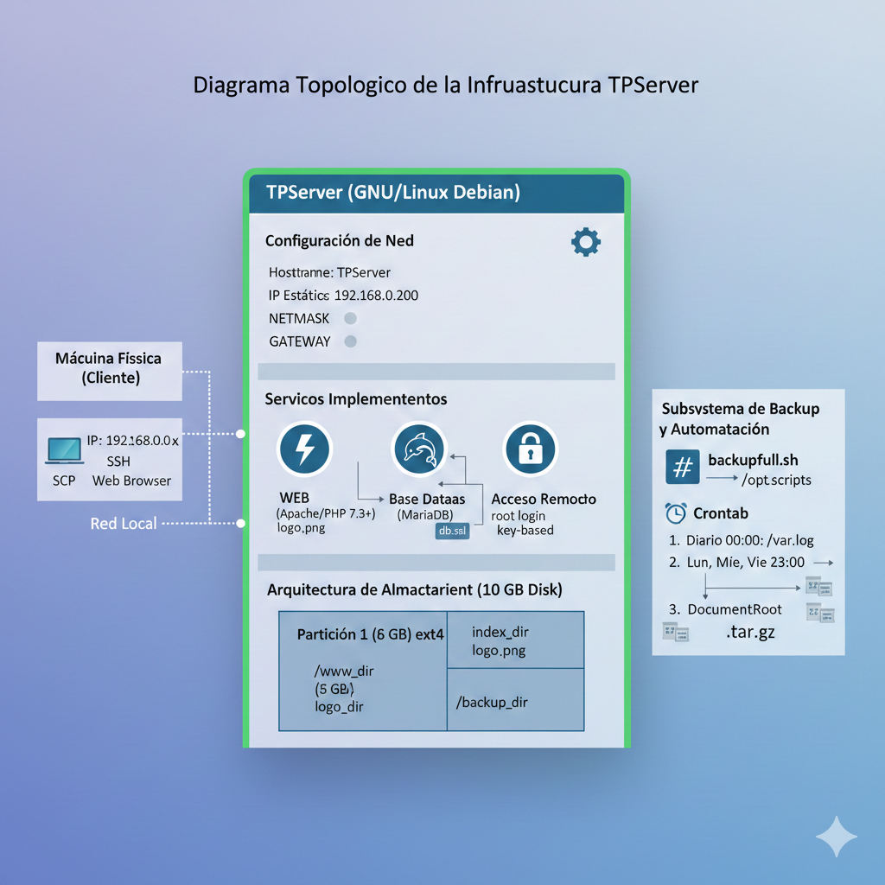

# 6) Entregables del TP


## 1) Crear un repositorio en github (es gratuito), y redactar el README.md con los nombres de los participantes del grupo.

### 1. Crear el Repositorio
1.  Ingresar a [GitHub](https://github.com/) e iniciar sesión.
2.  Crear el repositorio publico y asignarle el nombre tp-infraestructura-server

Para este caso se creo el repo en la URL es https://github.com/rcianni/tp-infraestructura-server


## 2) Subir, en el repositorio creado, los directorios: 
* “/root”, “/etc”, “/opt”, “/www_dir” y “/backup_dir”. Todos ellos comprimidos individualmente en formato “.tar.gz”. 
* “/var” se lo debe splitear en partes pequeñas para que pueda ser subido.

### Paso 1: Preparación del entorno

Primero,tenemos que tener git instalado en TPServer, luego creemos una carpeta temporal para organizar los archivos antes de subirlos, así no ensuciamos el sistema.

1. Abrir la terminal del server TPServer
2. Obtener permisos de administrador (si no iniciamos sesion como root):

```bash
root@TPServer:~# su -
```

3. Instalamos el cliente git
```bash
root@TPServer:~# apt-get install git -y
root@TPServer:~# git --version
git version 2.30.2
root@TPServer:~# 
```

4. Creamos directorio temporal para poner los achivos
```bash
root@TPServer:~# mkdir -p /tmp/github_upload
```


### Paso 2: Compresión de Directorios
Ahora vamos a comprimir los directorios que no requieren división (/root, /etc, /opt, /www_dir, /backup_dir). Usaremos la opción -P para evitar advertencias de rutas absolutas.

```bash
root@TPServer:~# tar -czPf /tmp/github_upload/root.tar.gz /root
root@TPServer:~# tar -czPf /tmp/github_upload/etc.tar.gz /etc
root@TPServer:~# tar -czPf /tmp/github_upload/opt.tar.gz /opt
root@TPServer:~# tar -czPf /tmp/github_upload/www_dir.tar.gz /www_dir
root@TPServer:~# tar -czPf /tmp/github_upload/backup_dir.tar.gz /backup_dir
root@TPServer:~# l /tmp/github_upload/
total 507
drwxr-xr-x  2 root root   1024 Dec  8 15:30 .
drwxrwxrwt 11 root root   1024 Dec  8 15:29 ..
-rw-r--r--  1 root root    150 Dec  8 15:30 backup_dir.tar.gz
-rw-r--r--  1 root root 502938 Dec  8 15:29 etc.tar.gz
-rw-r--r--  1 root root   1600 Dec  8 15:29 opt.tar.gz
-rw-r--r--  1 root root   6417 Dec  8 15:29 root.tar.gz
-rw-r--r--  1 root root   3008 Dec  8 15:29 www_dir.tar.gz
root@TPServer:~# 
```

### Paso 3: Compresión y Splitting de /var
El directorio /var suele ser pesado (logs, cache, bases de datos). Lo comprimiremos y al mismo tiempo lo cortaremos en pedazos de 45 MB (para estar seguros bajo el límite de 50MB de GitHub).

```bash
root@TPServer:~# tar -czPf - /var | split -b 45M -d - /tmp/github_upload/var_part.tar.gz.
root@TPServer:~# l /tmp/github_upload/
total 102554
drwxr-xr-x  2 root root     1024 Dec  8 15:32 .
drwxrwxrwt 11 root root     1024 Dec  8 15:29 ..
-rw-r--r--  1 root root      150 Dec  8 15:30 backup_dir.tar.gz
-rw-r--r--  1 root root   502938 Dec  8 15:29 etc.tar.gz
-rw-r--r--  1 root root     1600 Dec  8 15:29 opt.tar.gz
-rw-r--r--  1 root root     6417 Dec  8 15:29 root.tar.gz
-rw-r--r--  1 root root 94371840 Dec  8 15:32 var_part.tar.gz.00
-rw-r--r--  1 root root 10123207 Dec  8 15:32 var_part.tar.gz.01
-rw-r--r--  1 root root     3008 Dec  8 15:29 www_dir.tar.gz
root@TPServer:~# 
```

### Paso 4: Subir todo a GitHub
Ahora clonaremos tu repositorio dentro del servidor, moveremos los archivos comprimidos allí y "pushearemos" los cambios.

1. Clonar el repositorio:
```bash
root@TPServer:/tmp# cd /tmp
root@TPServer:/tmp# git clone https://github.com/rcianni/tp-infraestructura-server.git
Cloning into 'tp-infraestructura-server'...
warning: You appear to have cloned an empty repository.
root@TPServer:/tmp# git config --global user.email "ianni.roberto@gmail.com"
root@TPServer:/tmp# git config --global user.name "rcianni"
root@TPServer:/tmp# 
```

2. Mover los archivos y preparar la subida:

```bash
root@TPServer:/tmp# cd tp-infraestructura-server
root@TPServer:/tmp/tp-infraestructura-server# mv /tmp/github_upload/* .
root@TPServer:/tmp/tp-infraestructura-server# git add .
root@TPServer:/tmp/tp-infraestructura-server# git commit -m "Subiendo backups de directorios del sistema y var splitteado"
[master (root-commit) 0afb5df] Subiendo backups de directorios del sistema y var splitteado
 7 files changed, 0 insertions(+), 0 deletions(-)
 create mode 100644 backup_dir.tar.gz
 create mode 100644 etc.tar.gz
 create mode 100644 opt.tar.gz
 create mode 100644 root.tar.gz
 create mode 100644 var_part.tar.gz.00
 create mode 100644 var_part.tar.gz.01
 create mode 100644 www_dir.tar.gz
```

3. Enviar a GitHub:

Para obtener una clave hay que genrar un Token. Dentro de github.com, en mi pefil hay que ir a Developer settings y generar un Tokens (classic) con esta información:

Generar nuevo token (classic).
* Note: "TPServer Upload".
* Expiration: 7 days.
* Select scopes (Marcar la casilla repo (Full control of private repositories).


```bash
# usuario - rcianni
# clave - ghp_....
root@TPServer:/tmp/tp-infraestructura-server# git push
```


### Automatizar script

Para automatizar estas tareas se crea el script github_push_auto.sh [github_push_auto.sh](./docs/github_push_auto.sh) que realiza todas estas tareas de forma automatica.

----

## 3) Realizar un diagrama topológico de la infraestructura armada.

### Diagrama Topológico de la Infraestructura TPServer

Este diagrama detalla la arquitectura de red, los servicios instalados y la configuración de almacenamiento del servidor **TPServer**, que utiliza el sistema operativo **GNU/Linux Debian**.

### 1. Componentes Externos y Conectividad

La infraestructura se basa en una máquina virtual (VM) que interactúa con la máquina física (Cliente) del usuario, ambas en el mismo rango de red.

| Componente | Función | Conexión | Notas |
| :--- | :--- | :--- | :--- |
| **Máquina Física (Cliente)** | Punto de acceso (e.g., Mac). Utilizada para: Pruebas de conectividad web, transferencia de archivos (SCP), y acceso remoto SSH. | Red Local | Debe estar en el mismo rango de red que el servidor. |
| **Máquina Virtual (VM)** | Servidor principal (TPServer). | Red Local (IP Estática) | Alojamiento de todos los servicios. |

## 2. Configuración de Red del Servidor (TPServer)

El servidor utiliza una configuración de red estática.

*   **Hostname:** `TPServer`.
*   **IP Estática:** Configuramos la interfaz de red con una IP fija, incluyendo los campos `ADDRESS`, `NETMASK` y `GATEWAY` en el archivo de configuración. (Ejemplo de IP asignada: `192.168.0.200`).

## 3. Servicios Implementados en TPServer

| Servicio | Componente | Descripción |
| :--- | :--- | :--- |
| **WEB** | Apache con soporte PHP (v7.3 o superior). | Sirve los archivos `index.php` y `logo.png`. |
| **Base de Datos** | MariaDB. | Motor de base de datos que aloja el *script* `db.sql. El PHP se conecta a esta base de datos. |
| **Acceso Remoto** | SSH. | Permite la conexión del usuario *root* utilizando un par de claves privada/pública. |

## 4. Arquitectura de Almacenamiento

Se agregó un disco adicional de 10 GB para alojar particiones dedicadas, las cuales se montan automáticamente al iniciar el sistema operativo.

| Componente | Tamaño | Punto de Montaje | Función Principal | Tipo de Partición |
| :--- | :--- | :--- | :--- | :--- |
| **Disco Adicional** | 10 GB. | N/A | Contiene las particiones de datos y *backup*. | ext4 |
| **Partición 1** | 3 GB. | `/www_dir`. | Es el nuevo **DocumentRoot** de Apache, alojando `index.php` y `logo.png`. | Estándar (tipo 83). |
| **Partición 2** | 6 GB. | `/backup_dir`. | Destino de todos los *backups* generados por el script `backup_full.sh`. | Estándar (tipo 83). |

## 5. Subsistema de Backup y Automatización

El sistema utiliza un *script* programado para asegurar la persistencia de los datos.

*   **Script:** `backup_full.sh`, ubicado en `/opt/scripts`.
*   **Funcionalidad:** Acepta argumentos de origen y destino y valida la disponibilidad de los sistemas de archivos. Almacena los archivos comprimidos (`.tar.gz`) con formato de fecha ANSI.
*   **Automatización (Crontab):** El *script* está agendado para ejecutarse automáticamente:
    *   **Diario a las 00:00 hs:** Respalda `/var/log`.
    *   **Lunes, Miércoles y Viernes a las 23:00 hs:** Respalda `/www_dir`.



